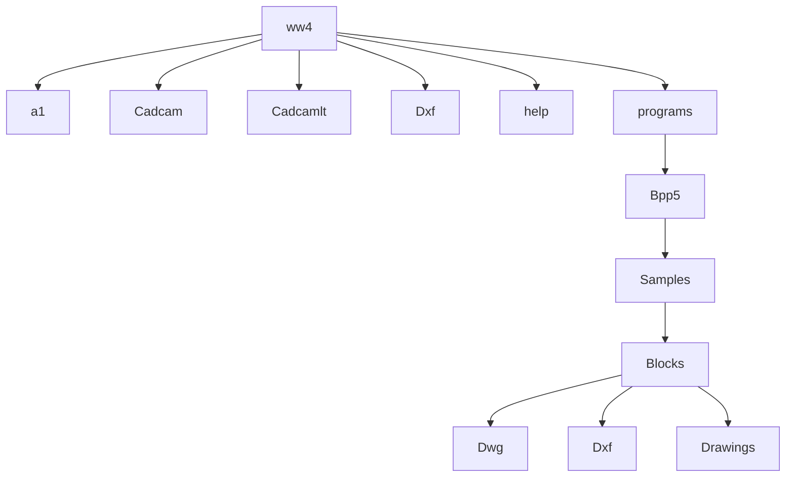

logo: WEEKE

icon: D with arrow

# woodWOP DXF-Import
# Basic

4.7.4

The graphics-supported post-processor converts CAD drawings to woodWOP programs.

| Features | Values |
| --- | --- |
| Windows operating system | NT 4.0 2000 98 XP |
| Source files | DXF files in text format |
| Destination files | MPR files from woodWOP 4.0 |

screenshot: woodWOP DXF-Import software interface

T:\\9882\\474260\\E0001SO.TIF

## Contents:

**1 Functions and Prerequisites** **3**
1.1 Requirements of the CAD System ............................................................................4
1.2 Requirements of the Drawings ..................................................................................5

**2 Operation** **6**
2.1 Screen layout.............................................................................................................6
2.1.1 Graphics area ............................................................................................................. 7
2.1.2 Dynamic Layout of Windows....................................................................................... 7
2.1.3 DXF window................................................................................................................ 8
2.1.4 Statusbar .................................................................................................................. 10
2.1.5 Color Settings ........................................................................................................... 10
2.2 Conversion context..................................................................................................11
2.2.1 Selecting a Conversion Context................................................................................ 15
2.2.2 Generating a Conversion Context............................................................................. 16
2.3 Conversion profile....................................................................................................17
2.3.1 Open conversion profile ............................................................................................ 18
2.4 Importing a Conversion Profile ................................................................................19
2.4.1 Preparing and Starting Conversion ........................................................................... 20
2.4.2 Error messages......................................................................................................... 20

**3 Conversion profile** **21**
3.1 Options ....................................................................................................................22
3.1.1 Zero Position in Drawings ......................................................................................... 23
3.1.2 MPR Header Options ................................................................................................ 23
3.1.3 Generate commentary macro ................................................................................... 28
3.1.4 Interpolation Accuracy for Ellipses ............................................................................ 29
3.1.5 Interpolation Accuracy for Splines............................................................................. 29
3.1.6 Epsilon Range for Summary of Elements ................................................................. 30
3.1.7 Optimizing Contour Path Elements ........................................................................... 31
3.1.8 Optimizing Polygon Elements ................................................................................... 32
3.1.9 MPR Coordinates = 'n' * DXF Coordinates ............................................................... 32
3.1.10 To the Active Layer before Conversion ..................................................................... 33
3.1.11 Decimal Point Characters ......................................................................................... 33
3.1.12 Variables................................................................................................................... 34
3.1.13 Optimizations ............................................................................................................ 38
3.1.14 Sort processes according to processing depth ......................................................... 38
3.2 Designation of Drawing Layers (Layer, Films) ........................................................39
3.3 Convertible woodWOP Macros ...............................................................................40
3.3.1 Workpiece................................................................................................................. 42
3.3.2 Workpiece with Values for Oversize and Offset Dimensions .................................... 42
3.3.3 Vertical Sawing, Automatic Groove Width................................................................. 43

logo: 8.8

9-882-47-4264 ENU11

icon: question and exclamation marks

1 / 66

logo: WEEKE

**woodWOP DXF-Import**

Basic

4.7.4

icon: arrow in square

3.3.4 Vertical Sawing with Specified Groove Width............................................................ 44
3.3.5 Vertical Sawing with Optional Unit Number............................................................... 44
3.3.6 Universal sawing ....................................................................................................... 45
3.3.7 Geometry Transfer as a Contour Element ................................................................ 46
3.3.8 Geometry Transfer as a Nesting Safety Contour ...................................................... 46
3.3.9 Vertical trimming ....................................................................................................... 47
3.3.10 Vertical Trimming as a Nesting Contour.................................................................... 47
3.3.11 Polygon paths ........................................................................................................... 48
3.3.12 Vertical drilling........................................................................................................... 49
3.3.13 Drilling, horizontal ..................................................................................................... 50
3.3.14 Vertical Pockets ........................................................................................................ 51
3.3.15 Free-Form Pockets ................................................................................................... 51
3.3.16 Horizontal pockets .................................................................................................... 52
3.3.17 Universal drilling........................................................................................................ 53
3.3.18 Underfloor drilling ...................................................................................................... 54
3.3.19 Underfloor Pockets ................................................................................................... 55
3.3.20 Dowel Components................................................................................................... 56
3.3.21 Components for Workpiece Clamps ......................................................................... 57
3.3.22 Vacuum suction unit.................................................................................................. 58

# 4 Sample Files 59

# 5 Overview of Drawing Layers 60

# 6 Options 62

## 6.1 Call-up Parameters..................................................................................................62

icon: hand with pen 8.8

9-882-47-4264 ENU11

icon: question and exclamation mark in book

2 / 66

logo: WEEKE

woodWOP DXF-Import
Basic

4.7.4

icon: DXF Import

# 1 Functions and Prerequisites

The program converts DXF files to woodWOP format (MPR files) using specific rules. The rules are collected together in a conversion profile.

In the basic version of DXF data transfer, the conversion profile cannot be modified, but supplied conversion profiles can be opened and used.

The result of the conversion is a woodWOP file with all the usual woodWOP functions.

```mermaid
graph TD
    A[CAD system(e.g. AutoCAD)] --> B(DXF)
    B --> C[CAD data transfer]
    C --> D(woodWOP format(MPR))
    D --> E[woodWOP]
```

icon: pointing hand

**Note:**

The settings (names for drawing layers...) from the previous version (4.0) of the post-processor can be applied.

icon: pointing hand

**Note:**

Generated woodWOP programs must be checked in woodWOP.

T:\9882\474260\E0100so.tif

icon: pen writing 8.8

9-882-47-4264 ENU11

icon: question mark and exclamation mark on book

3 / 66

logo: WEEKE

woodWOP DXF-Import
Basic

4.7.4

icon: DXF import symbol

## 1.1 Requirements of the CAD System

Any CAD system can be the source for the DXF conversion to woodWOP format. The CAD system must meet the following requirements:

* CAD files must be saved in DXF format.

* The CAD system must be able to work with drawing layers.

    - Layer

    - Films
    - ...

* Alphanumeric values must be permitted when naming the drawing layers.

* For full functionality of the CAD interface, the CAD system must allow the combination of drawing elements.

    - Create blocks

    - Create groupings

icon: hand with pen 8.8

9-882-47-4264 ENU11

icon: question and exclamation mark in a book

4 / 66

logo: WEEKE

**woodWOP DXF-Import**
Basic

4.7.4

icon: DXF import symbol

# 1.2 Requirements of the Drawings

* Use suitable drawing elements:

    - Dimensions, hatching, text etc. cannot be transferred or can only be transferred in a limited manner.

* Specific assignment of the drawing elements to drawing layers.

    This defines how the drawing elements are interpreted and the information that is transferred.

* Use predefined blocks to generate specific woodWOP macros.

    - Mirroring of blocks is not permitted. Required blocks are supplied as DXF and DWG files.

* Unintended conversion results and broken contour paths are caused by drawings that are not correctly executed.

* If CAD geometries are to produce uninterrupted woodWOP contour paths, then these must be drawn without gaps and intersections. This is to be achieved by using the snap function during drawing.

* Overlapping of several drawing elements in one drawing layer can result in ambiguities and must be avoided.

engineering_drawing: comparison of incorrect (gap) vs correct (snapped) line connection

engineering_drawing: comparison of incorrect (intersection) vs correct (clean corner) line connection

engineering_drawing: comparison of incorrect (overlapping lines) vs correct (single line) drawing

T:\9882\474260\E0102so.tif

logo: hand with pen

9-882-47-4264 ENU11

logo: question mark and exclamation mark on a book

5 / 66

logo: WEEKE woodWOP DXF-Import Basic

4.7.4

icon: woodWOP logo

# 2 Operation

## 2.1 Screen layout

screenshot: woodWOP DXF-Import software interface with numbered callouts 1.0 through 1.8

| 1.0 | Drop-down menus |
| --- | --- |
| 1.1 | Graphics area |
| 1.2 | Change display in the working area (messages or conversion profile) |
| 1.3 | Start conversion |
| 1.4 | Working area: Display of messages or conversion profile |
| 1.5 | Dynamic Layout of Windows |
| 1.6 | DXF window |
| 1.7 | Display options for the DXF window |
| 1.8 | Statusbar |

logo: hand with pen 8.8

9-882-47-4264 ENU11

icon: question mark and exclamation mark on a book

6 / 66

logo: WEEKE woodWOP DXF-Import Basic

4.7.4

icon: arrow entering a square

## 2.1.1 Graphics area

Display of the geometry of the loaded DXF file.

Individual drawing elements in the graphic can be marked using the mouse. The marked elements are then displayed in DXF window **1.6**.

When an expert is selected in working area **1.4** or a conversion rule is selected, the related drawing elements are shown in a light color.

## 2.1.2 Dynamic Layout of Windows

The size of the DXF window, the graphics area and the working area can be changed using the mouse.

icon: hand with pen 8.8

9-882-47-4264 ENU11

icon: question and exclamation mark in a book

7 / 66

logo: WEEKE woodWOP DXF-Import Basic

4.7.4

icon: DXF import arrow

## 2.1.3 DXF window

Display of the following properties of the open DXF file in the DXF window.

* Name and folder **2.2**

* Drawing levels (Layer, films etc.) **2.3**

* Blocks with details such as element type and color **2.4**

* Selected entities **2.5**

screenshot_from_computer: DXF window interface with callouts 2.0 through 2.5

T:\\9882\\474260\\E0103so.tif

icon: pointing hand

**Note:**

Click on expansion icon **2.1** to open the area selected.

logo: pen icon 8.8

9-882-47-4264 ENU11

icon: question and exclamation marks in a book

8 / 66

logo: WEEKE

# woodWOP DXF-Import

Basic

4.7.4

icon: DXF import arrow

The display of the DXF window can be changed using three buttons 2.0:

* Enable and disable automatic update of the selected drawing elements. The "Off" state is indicated by a hidden icon.

icon: information update

* Hide selected drawing elements in the DXF window.

icon: hide elements

* Apply other settings for the DXF window.

icon: settings

* Activated functions are displayed in the DXF window.

[ ] Extended Entity Data

[ ] Block attribute

[ ] Object coordinate system

[x] Prominent points

[ ] Punkte P0, P1

T:\9882\474260\E0107so.tif

logo: hand with pen 8.8

9-882-47-4264 ENU11

icon: question mark and exclamation point on book

9 / 66

logo: WEEKE woodWOP DXF-Import Basic

4.7.4

icon: woodWOP logo

## 2.1.4 Statusbar

Display of useful information in the status bar.

screenshot: status bar with callouts 3.0, 3.1, 3.2

| 3.0 | Status or help text for the drop-down menus |
| --- | --- |
| 3.1 | Current conversion context |
| 3.2 | Current conversion profile |

icon: pointing hand
**Note:**

The status bar can be displayed or hidden via the drop-down menu.

screenshot: Bpp5 View menu showing Status row checked

T:\9882\474260\E0109so.tif

## 2.1.5 Color Settings

➢ Select menu item "Settings > Display."

⇨ The color settings for the background and the zero point can be changed.

screenshot: Color settings dialog box

T:\9882\474112\E0122so.PNG

icon: pen writing 8.8

9-882-47-4264 ENU11

icon: question mark and exclamation mark on a book

10 / 66

logo: WEEKE woodWOP DXF-Import Basic

4.7.4

icon: blue arrow in square

## 2.2 Conversion context

Indication of various default settings in the conversion context.

For example:

The storage location of converted woodWOP programs.

screenshot: Bpp5 software menu showing Context options

T:\9882\474260\E0101so.tif

Conversion context **4.1** comprises several settings.

Double-clicking on icon **4.0** changes the setting.

* Path to the DXF files

$\Rightarrow$ Default folder for loading CAD source files.

* Path to the macro programs

* Saves the converted woodWOP program in this folder. When check box **4.2** is selected, a folder can be selected for each conversion.

screenshot: Edit the context dialog box with callouts 4.0, 4.1, and 4.2

logo: hand with pen 8.8

9-882-47-4264 ENU11

icon: question mark and exclamation mark on open book

11 / 66

logo: WEEKE

icon: arrow entering box

# woodWOP DXF-Import Basic

4.7.4

* Path to the macro program elements

$\Rightarrow$ Macro program elements such as polygon paths and components are saved in this folder. When the check box is selected, a folder can be selected for each conversion.

* Request conversion profile, beginning with or in the folder

$\Rightarrow$ The conversion profile given is used. When the check box is selected, a profile can be selected for each conversion.

* Hide status dialog during conversion?

$\Rightarrow$ The setting given is used. When the check box is selected, you can choose whether the dialog is displayed or hidden for each conversion.

icon: hand writing 8.8

9-882-47-4264 ENU11

icon: question and exclamation mark in a book

12 / 66

logo: WEEKE

icon: woodWOP DXF-Import

# woodWOP DXF-Import
Basic

4.7.4

* Start woodWOP after successful conversion?

$\Rightarrow$ The setting given is used. When the check box is selected, one of the following settings can be selected for each conversion.

screenshot: woodWOP dialog box with options No, Open, and Add labeled 5.0, 5.1, and 5.2

T:\9882\474260\e0003so.tif

**No 5.0:**

Generates an MPR program with the name of the DXF drawing.

**Open 5.1:**

Generates an MPR program with the name of the DXF drawing and opens it in woodWOP.

**Add 5.2:**

Adds the generated MPR program to the MPR program currently loaded in woodWOP.

Corresponds to the woodWOP function "Add file."

icon: hand with pen 8.8

9-882-47-4264 ENU11

logo: question and exclamation mark

13 / 66

logo: WEEKE

# woodWOP DXF-Import
Basic

4.7.4

icon: arrow entering a box

* Change long file names in folders to max. 8 characters.

⇨ The setting given is used. When the check box is selected, the settings can be selected for each conversion.

**Example:**

No selected:

⇨ C:\WW4\A1\Mp4\Langer_Programmname.mpr

Yes selected:

⇨ C:\WW4\A1\Mp4\Lan\ger_Prog\rammname.mpr

icon: pointing hand

**Note:**

It is possible to generate several conversion contexts.

The context to be used following program start can be defined.

logo: 8.8

9-882-47-4264 ENU11

icon: question and exclamation mark on a book

14 / 66

logo: WEEKE woodWOP DXF-Import Basic

4.7.4

icon: arrow in square

## 2.2.1 Selecting a Conversion Context

* Open a conversion context

screenshot: Bpp5 software menu showing File, Properties, View, ? with Context selected and sub-menu Change profile, Profile at program start:

T:\\9882\\474260\\E0101so.tif

* Click arrow button **6.1** and select the required context.

screenshot: Edit the context window showing various paths and options with callouts 6.0 and 6.1

T:\\9882\\474260\\E0101so.tif

icon: pointing hand

**Note:**

When check box **6.0** is selected, the context selected is used each time the program is started.

icon: hand with pen 8.8

9-882-47-4264 ENU11

icon: question and exclamation mark in a book

15 / 66

logo: WEEKE woodWOP DXF-Import Basic

4.7.4

icon: arrow in square

## 2.2.2 Generating a Conversion Context

* Click current context **7.1**.

* Enter a name for the new context and confirm by pressing ⏎.

* Accept the subsequent confirmation prompt.

⇨ The context is generated using the name given and the required settings can be made.

* Double-click the required setting **7.0** and make any changes. When you close the window, you can decide whether the changes are to be saved.

screenshot: Edit the context dialog window with callouts 7.0 and 7.1

icon: hand with pen 8.8

9-882-47-4264 ENU11

icon: question mark and exclamation mark on open book

16 / 66

logo: WEEKE woodWOP DXF-Import Basic

4.7.4

icon: DXF import symbol

## 2.3 Conversion profile

A conversion profile contains rules according to which the conversion will be executed.

* Conversion profiles are independent of the computer used and can be exchanged as required between different computers.

* Conversion profiles are saved in the form of an initialization file (*.ini).

* The rules of the conversion profiles cannot be changed in the woodWOP DXF Import Basic version.

icon: pointing hand

**Note:**

Documentation includes an overview for designation of the drawing layers (layer codes).

icon: pen writing 8.8

9-882-47-4264 ENU11

icon: question and exclamation mark on a book

17 / 66

logo: WEEKE

woodWOP DXF-Import
Basic

4.7.4

icon: DXF import

## 2.3.1 Open conversion profile

Load conversion profile before using the post-processor.

➢ Open conversion profile

screenshot_from_computer: Bpp5 File menu showing Open profile... option

➢ Select required profile in the dialog window.

screenshot_from_computer: Open dialog window for selecting a conversion profile .ini file

⇨ The selected profile is loaded. The name of the conversion profile **8.0** is displayed in the status bar.

8.0

icon: pointing hand

**Note:**

The woodWOP DXF Import Professional version enables new profiles to be generated and customized.

icon: pen writing 8.8

9-882-47-4264 ENU11

icon: question and exclamation marks in a book

18 / 66

logo: WEEKE woodWOP DXF-Import Basic

4.7.4

icon: arrow in square

## 2.4 Importing a Conversion Profile

The settings (names for drawing layers...) from the previous version (4.0) of the post-processor can be applied.

➢ Bpp.ini for version 4.0 must be opened

screenshot: Bpp5 File menu showing Open profile... selected
\:\9882\474260\E0114so.tif \

➢ Perform the required settings in the window and confirm with OK.

T:\9882\474260\E0115so.tif

➢ Save profile

icon: pointing hand

**Note:**

* The saved profile must then be opened so that it is displayed in the status bar.

* The names for your drawing layers correspond to the settings in the imported bpp.ini file.

screenshot: Bpp5 File menu showing Save profile selected

T:\9882\474260\E0111so.tif

logo: WEEKE

8.8

9-882-47-4264 ENU11

icon: question and exclamation marks in a book

19 / 66

logo: WEEKE woodWOP DXF-Import Basic

4.7.4

icon: arrow entering box

## 2.4.1 Preparing and Starting Conversion

* DXF source file must be loaded
* Open the required conversion profile, then modify as necessary or use the active profile.
* Activate the required conversion context, then modify as necessary or use the active context.
* Start conversion.
* Check any error messages and the generated woodWOP-Programm and modify as necessary.

## 2.4.2 Error messages

Should an error occur during the conversion, error messages are displayed in the working area.

* Double-click the error message
    - The program automatically switches to the error source.
    - Remedy the error and restart the conversion.

logo: HOMAG Group 8.8

9-882-47-4264 ENU11

icon: question mark and exclamation mark on open book

20 / 66

logo: WEEKE

woodWOP DXF-Import Basic

4.7.4

icon: arrow in square

# 3 Conversion profile

A conversion profile contains information on the relationships between the drawing elements of the DXF file and the woodWOP macros to be generated for the MPR program.

A conversion profile comprises options **9.0** and experts **9.1**.

The options contain general settings for the conversion.

The individual experts contain conversion rules, by which a woodWOP macro is created from DXF drawing elements.

In the woodWOP DXF Import Basic version, only options **9.0** can be individually adapted. Experts **9.1** are preset and cannot be edited.

Documentation includes an overview for designation of the drawing layers (layer codes).

screenshot: woodWOP conversion profile tree showing Options (9.0) and various experts (9.1) like Workpiece, Cutting, Contours, Horizontal boring, Vertical boring, and Freely-defined macros

icon: pointing hand

## Note:

Change the display (messages/conversion profile) by clicking button **10.0** in the status bar.

screenshot: status bar showing button 10.0

icon: pen writing
8.8

9-882-47-4264 ENU11

logo: question mark and exclamation mark on open book
21 / 66

logo: WEEKE woodWOP DXF-Import Basic

4.7.4

icon: DXF import symbol

## 3.1 Options

The options for the conversion profile allow you to make general settings.
You can determine which option is active using the context menu.

* Position mouse pointer on Options and press the right mouse button.

* The required option can be activated or deactivated in the context menu.

icon: pointing hand

**Note:**

Proceed as follows to implement changes in the options.

* Double-click the required option.

* Make settings.

* Text entries in text lines must be finished with ↵!

* Save profile (in the "File" menu)

screenshot: woodWOP DXF-Import Options context menu

screenshot: MPR header options and interpolation settings

logo: WEEKE
8.8

9-882-47-4264 ENU11

icon: help and information
22 / 66

logo: WEEKE woodWOP DXF-Import Basic

4.7.4

icon: DXF import symbol

## 3.1.1 Zero Position in Drawings

Defines the position of the zero point in the DXF drawing that is positioned in the woodWOP zero point.

* Click on the corresponding icon of the drawing zero point

$\Rightarrow$ The drawing zero point is activated and highlighted against a white background

engineering_drawing: Zero position in drawing selection interface
T:\9882\474110\E0028so.tif

## 3.1.2 MPR Header Options

Machine type selection and definition of NC generator settings.

These parameters are used to preset the NC generator settings in woodWOP by the values defined here.

* Double-click the MPR header options row

$\Rightarrow$ Input window for machine type selection and NC generator settings open

icon: MPR header options WEEKE
T:\9882\474110\E0033so.tif

**MPR header options**

**Type of machine**: Weeke [dropdown] [OK] [Cancel]

**Optimizations**
* **Of all vertical drillholes** [dropdown]
* [ ] Avoid clearance height for horizontal bore holes
* [ ] Avoid clearance ht. for underfloor process
* [ ] Blockwise optimization of the vertical bore holes
* [ ] Avoid clearance height for post-processing.
* [ ] Combine edges, max.length: [2000]

**At NC program end**
* [ ] Workpiece not transported (only continuous feed table)
* [ ] Do not clear tools when program ends
* **Withdrawal relative to workpiece length of**: [400]

**NC output**:
* [ ] Unit of measurement in inch
* **Rotation angle of the NC program**: [0°] [dropdown]
* [x] Generate non-mirrored
* [ ] Generate mirrored in X
* [ ] Generate mirrored in Y
* [ ] Generate mirrored in X and Y
* [ ] Generate as subprogram

T:\9882\474112\E0109so.PNG

icon: hand with pen 8.8

9-882-47-4264 ENU11

logo: question mark and exclamation mark on open book

23 / 66

logo: WEEKE

icon: woodWOP DXF-Import

# woodWOP DXF-Import Basic

### 4.7.4

## Machine type

Use the drop-down menu to select the required machine type.

screenshot_from_computer: Machine type selection menu showing options like HOMAG, CF-HOMAG, FK-HOMAG, WEEKE, BST-WEEKE, HOMAG PC83, and HOMAG PC85. File path T:\9882\474112\E0110so.PNG is visible below.

icon: pointing hand

**Note:**

Depending on the machine type selection, the settings available for the NC generator are activated.
The selection options correspond to the settings in woodWOP.

## Optimizations

* Optimization of drill holes
Selecting this option from the drop-down menu sets the path optimization for drill holes.

screenshot_from_computer: Optimizations menu with a drop-down for drill hole optimization and checkboxes for avoiding clearance height and merging edges. File path T:\9882\474112\E0111so.PNG is visible below.

* Avoid clearance height for horizontal bore holes
If the checkbox is activated, parallel horizontal processing operations take place at processing height.

screenshot_from_computer: Checkbox for 'Avoid clearance height for horizontal bore holes' is checked. File path T:\9882\474112\E0123so.PNG is visible below.

icon: pencil writing 8.8

9-882-47-4264 ENU11

icon: question mark and exclamation point on a book

24 / 66

logo: WEEKE

# woodWOP DXF-Import Basic

4.7.4

icon: DXF import arrow

* Avoid clearance ht. for underfloor process
If the checkbox is activated, the unit is removed from the workpiece when moving to the next underfloor processing and moved to the next processing operation at the same Z height.

[x] Avoid clearance ht. for underfloor process

T:\9882\474112\E0124so.PNG

* Blockwise optimization of the vertical bore holes
If the checkbox is activated, vertical drill holes programmed in sequence are optimized below one another in succession.

[x] Blockwise optimization of the vertical bore holes

T:\9882\474112\E0125so.PNG

* Avoid clearance height for post-processing
If the checkbox is activated and the flush trimming/scraper unit is used, travel in Z between the processing operations "Flush edge trimming" and "Remove edge" is not performed at clearance level.

[x] Avoid clearance height for post-processing.

T:\9882\474112\E0126so.PNG

* Combine edges, max. length:
If the checkbox is activated, consecutive edge gluing steps are combined. The complete length of the edge material up to the maximum length specified here is fed into the gluing unit in a single process.

[x] Combine edges, max.length: [2000]

T:\9882\474112\E0127so.PNG

icon: hand with pen 8.8

9-882-47-4264 ENU11

icon: question and exclamation marks in a book

25 / 66

logo: WEEKE

icon: arrow in square

# woodWOP DXF-Import

Basic 4.7.4

---

## At NC program end

* Workpiece not transported (only continuous feed table)

[x] Workpiece not transported (only continuous feed table]

T:\9882\474112\E0128so.PNG

* Do not clear tools when program ends
If the checkbox is activated, the tool is not placed in the tool changer at the end of the NC program

[x] Do not clear tools when program ends

T:\9882\474112\E0129so.PNG

* Free motion mode and free motion value
The parking position of the support once the NC program has ended is set by selecting this option in the drop-down menu and entering the corresponding value.

Withdrawal relative to workpiece length of: [400]
[ Withdrawal in Z ]
[ <mark>Withdrawal relative to workpiece length of:</mark> ]
[ Absolute withdrawal to X = ]
[ Absolute free travel to X + end position ]
[ Absolute free travel to machine center ]
[ Absolute free travel to X end position ]

T:\9882\474112\E0130so.PNG

---

## NC output

* Unit of measurement in inch
If the checkbox is activated, the unit of measurement in woodWOP is changed from **mm** to **inch**.

[x] Unit of measurement in inch

T:\9882\474112\E0131so.PNG

* Rotation angle of the NC program
Selecting this option from the drop-down menu allows a rotation angle of 0°, 90° or -90° to be specified.

Rotation angle of the NC program [0°]

T:\9882\474112\E0132so.PNG

icon: hand with pen 8.8

9-882-47-4264 ENU11

logo: question mark and exclamation mark on book

26 / 66

logo: WEEKE

icon: woodWOP DXF-Import

# woodWOP DXF-Import

Basic

4.7.4

* **Generate non-mirrored**

If this checkbox is activated, a non-mirrored workpiece is created when generating the NC program.

[x] Generate non-mirrored

T:\9882\474112\E0133so.PNG

* **Generate mirrored in X**

If this checkbox is activated, a workpiece mirrored in the X direction is created when generating the NC program.

[x] Generate mirrored in X

T:\9882\474112\E0134so.PNG

* **Generate mirrored in Y**

If this checkbox is activated, a workpiece mirrored in the Y direction is created when generating the NC program.

[x] Generate mirrored in Y

T:\9882\474112\E0135so.PNG

* **Generate mirrored in X and Y**

If this checkbox is activated, a workpiece mirrored in the X and Y directions is created when generating the NC program.

[x] Generate mirrored in X and Y

T:\9882\474112\E0136so.PNG

* **Generate as subprogram**

If this checkbox is activated, all mirrored and non-mirrored workpieces are created when generating the NC program.

[x] Generate as subprogram

T:\9882\474112\E0137so.PNG

logo: WEEKE 8.8

9-882-47-4264 ENU11

icon: help

27 / 66

logo: WEEKE woodWOP DXF-Import Basic

4.7.4

icon: arrow in square

### 3.1.3 Generate commentary macro

This option activates the creation of a commentary macro in the woodWOP program.

Any text can be entered for the commentary. The output can be spread across several lines of text and automatically supplemented with various items of information:

* \n

$\Rightarrow$ Effects a line break

* >Date<

$\Rightarrow$ Date of generation

* >Time<

$\Rightarrow$ Time of generation

* >Profile<

$\Rightarrow$ Conversion profile used

* >DXF<

$\Rightarrow$ DXF source file used

* >Context<

$\Rightarrow$ Context used

* >SizeX<

$\Rightarrow$ Workpiece length

* >SizeY<

$\Rightarrow$ Workpiece width

* >SizeZ<

$\Rightarrow$ Workpiece thickness

icon: Generate commentary macro Abc
T:\9882\474110\E0034so.tif

**Example:**

screenshot: woodWOP interface showing Generate commentary macro field with text Datum:>Date<\nUhrzeit:>Time<
T:\9882\474110\E0045so.tif

**Result in woodWOP:**

screenshot: woodWOP result showing Comment: Datum:04/17/03 Uhrzeit:11:16:31
T:\9882\474110\E0044so.tif

icon: hand with pen 8.8

9-882-47-4264 ENU11

logo: question mark and exclamation mark on open book

28 / 66

logo: WEEKE woodWOP DXF-Import Basic

4.7.4

icon: DXF import

### 3.1.4 Interpolation Accuracy for Ellipses

diagram: Interpolation accuracy for ellipses 0.001
T:\9882\474110\E0035so.tif

Defines the accuracy with which ellipses are converted into polylines (comprising lines and arcs of circles).

* The smaller the value, the greater the accuracy used for the conversion.

* Possible values are 0.00001 and above.

### 3.1.5 Interpolation Accuracy for Splines

diagram: Interpolation accuracy for splines 0.001
T:\9882\474110\E0036so.tif

Defines the accuracy with which splines are converted into polylines (comprising lines and arcs of circles).

The value defines the maximum angular deviation from the spline contour to the generated arc end points in the radian.

* The smaller the value, the greater the accuracy used for the conversion.

* Possible values are 0.00001 and above.

icon: pointing hand

**Note:**

The value 0.025 corresponds approximately to one degree.

logo: pen and ruler

8.8 **9-882-47-4264** ENU11

icon: question and exclamation mark

29 / 66

logo: WEEKE woodWOP DXF-Import Basic

4.7.4

icon: arrow in square

## 3.1.6 Epsilon Range for Summary of Elements

Defines the epsilon range for the contour tracing (combination of drawing elements into contours) and the optimization of rows of holes (combination of drill holes into rows of holes).

Possible values are 0.00001 and above.

**Example:** 0.001

> Mpr<sub>ε</sub> Epsilon range for summary of elements
> 0.001
> T:\9882\474110\E0037so.tif

**Result in woodWOP:**

* Geometric elements for contour paths that are a maximum of 0.001 apart are combined into one contour path.

* Geometric elements with a maximum clearance of 0.001 mm are classified as a drill hole.

icon: hand with pen 8.8

9-882-47-4264 ENU11

logo: question and exclamation mark in book

30 / 66

logo: WEEKE woodWOP DXF-Import Basic

4.7.4

icon: arrow in square

## 3.1.7 Optimizing Contour Path Elements

This option allows you to make settings for contour tracing (combination of contour elements into contours):

engineering_drawing: Optimizing contour path elements settings dialog

11.0 11.1 11.2

**Checkbox 11.0**

Active:

$\Rightarrow$ Double contour elements are **not** taken into account.

Inactive:

$\Rightarrow$ Double contour elements are taken into account. For large programs, this shortens the time required for the conversion at the expense of an optimal result.

**Checkbox 11.1**

Active:

$\Rightarrow$ Contour tracing is performed.

Inactive:

$\Rightarrow$ Contour tracing is **not** performed.

**Entry 11.2**

$\Rightarrow$ Number of contours that are checked for the addition of a contour element. All contours are checked when "-1" is entered (recommended).

icon: hand with pencil 8.8

9-882-47-4264 ENU11

logo: question mark and exclamation mark on open book

31 / 66

logo: WEEKE woodWOP DXF-Import Basic

icon: arrow in square

4.7.4

## 3.1.8 Optimizing Polygon Elements

This option allows the settings for the contour tracing of the polygon paths (woodWOP) to be configured.

icon: pointing hand
**Note:**

The settings are identical to those for "Optimizing contour path elements."

## 3.1.9 MPR Coordinates = 'n' * DXF Coordinates

This option enables DXF files that have not been prepared in scale 1:1 to be converted. All geometry data is multiplied by the value given.

icon: pointing hand
**Note:**

Direct access to DXF group codes is not taken into account by this setting!

Optimizing polygon elements
[x] 10 Test contours to see if possible to jo
[ ] No doubled contour elements
T:\9882\474110\E0039so.tif

1:n MPR coordinates = 'n' * DXF coordinates
1
4
T:\9882\474110\E0040so.tif

logo: pen writing 8.8

9-882-47-4264 ENU11

logo: question and exclamation mark in book

32 / 66

logo: WEEKE woodWOP DXF-Import Basic

4.7.4

icon: blue arrow in square

## 

 3.1.10 To the Active Layer before Conversion

This option allows deactivated drawing layers (Layer, films etc.) to be activated prior to conversion.

form: To the active layer before conversion field

icon: pointing hand
**Note:**

* Multiple drawing layers can be entered. These must be separated by a comma.

* Placeholders can also be used. Thus, for instance, all Layer are activated when a "*" (asterisk) is entered.

## 

 3.1.11 Decimal Point Characters

form: Decimal point characters: Underline field

This entry defines the decimal separator in the drawing layer (Layer, film etc) of the CAD program.

icon: pen writing
8.8

9-882-47-4264 ENU11

logo: question mark and exclamation mark on open book
33 / 66

logo: WEEKE

woodWOP DXF-Import
Basic

4.7.4

icon: DXF import symbol

## 3.1.12 Variables

Variables can be transferred with the DXF drawing and automatically generated. As is the case with conversion rules, the variables are created via the context menu.

image: woodWOP variables interface screenshot
Name VBDepth § Line, Layer.Drill_1, p.VA=GRP10013
T:\9882\474112\E0115so.PNG

icon: pointing hand

**Note:**

Use the "space bar" or double-click the variable symbol to switch between variable types.

### Blocked

Blocked variables are not generated.

image: blocked variable interface screenshot
T:\9882\474112\E0121so.PNG

### Workpiece length

This special variable depends on the term normally entered in the "workpiece" expert with the parameter for the length (p.LA).

$\Rightarrow$ The name used corresponds to the variable name generated in woodWOP.

$\Rightarrow$ Variable is created in woodWOP in the variable table with the corresponding value.

$\Rightarrow$ Variable is assigned to finished part length in woodWOP in the workpiece macro.

image: workpiece length variable interface screenshot
Name = image: workpiece icon
T:\9882\474112\E0117so.PNG

icon: pen writing 8.8

9-882-47-4264 ENU11

icon: question and exclamation mark in a book

34 / 66

logo: WEEKE

## woodWOP DXF-Import

Basic

4.7.4

icon: woodWOP DXF-Import

## Workpiece width

This special variable depends on the term normally entered in the "workpiece" expert with the parameter for the width (p.BR).

$\Rightarrow$ The name used corresponds to the variable name generated in woodWOP.

$\Rightarrow$ Variable is created in woodWOP in the variable table with the corresponding value.

$\Rightarrow$ Variable is assigned to finished part width in woodWOP in the workpiece macro.

icon: variable name width Name W = icon: workpiece width
T:\\9882\\474112\\E0118so.PNG

## Workpiece thickness

This special variable depends on the term normally entered in the "workpiece" expert with the parameter for the thickness (p.DI).

$\Rightarrow$ The name used corresponds to the variable name generated in woodWOP.

$\Rightarrow$ Variable is created in woodWOP in the variable table with the corresponding value.

$\Rightarrow$ Variable is assigned to finished part thickness in woodWOP in the workpiece macro.

icon: variable name thickness Name th = icon: workpiece thickness
T:\\9882\\474112\\E0119so.PNG

icon: 8.8 8.8

9-882-47-4264 ENU11

icon: help and information

35 / 66

logo: WEEKE

# woodWOP DXF-Import
# Basic

4.7.4

icon: DXF import symbol

## Normal variable

The term text defines the value of the variables. Additional information in terms of assignment rows is not possible.

$\Rightarrow$ The name used corresponds to the variable name generated in woodWOP.

$\Rightarrow$ Variable is created in woodWOP in the variable table with the corresponding value.

icon: variable checkbox **Name** VD_Depth = 50

T:\9882\474112\E0138so.PNG

logo: selection result icon **Selection** Circle, Layer.V_BohrLS, Layer.V_DrillSF
**Result** PRIO=-20, <mark>P.TI=VD_Depth</mark>, P.BM=''LS''

T:\9882\474112\E0139so.PNG

icon: pointing hand
**Note:**

Assignment of <u>variables in the experts via</u> <u>the result line cannot be implemented in</u> woodWOP DXF Import Basic.

<u>Assignment of variables to a parameter</u> <u>must be implemented in woodWOP after</u> successful conversion.

icon: pen writing

9-882-47-4264 ENU11

icon: question and exclamation mark book

36 / 66

logo: WEEKE

icon: woodWOP DXF-Import

# woodWOP DXF-Import
## Basic

4.7.4

## Variable relating to entities

The term text for the variables selects existing entities in the drawing. The variable value is assigned by entering "p.VA=." This is defined analogous to the result line of the associated conversion rule. The default value of the variables defined previously is assigned by entering "p.VA=" again.

\* Name DUEB = § Line, Layer.DUEBEL, p.VA=GRP10013, p.VA="0"
T:\\9882\\474112\\E0120so.PNG

icon: pointing hand

**Note:**

It is essential to assign the variable value after the selection.

Additional information in terms of assignment rows is not possible.

**Example:**

**Line, Layer.DUEBEL, p.VA=GRP10013, p.VA="0"**

* Line
  Drawing element type is Line

* **Layer.DUEBEL**
  Element is assigned to drawing layer DUEBEL

* **p.VA=GRP10013**
  Variable value is determined by means of the line length of the drawing element

* **p.VA="0"**
  Variable value "0" is transferred as the default value of the variables

logo: 8.8

9-882-47-4264 ENU11

icon: question and exclamation mark

37 / 66

logo: WEEKE
**woodWOP DXF-Import**
Basic

4.7.4

icon: woodWOP DXF-Import

# 3.1.13 Optimizations

<u>Optimize movements in PLY files</u>

If the checkbox is activated, contours within PLY files are arranged such that empty runs within the polygon path are optimized.

icon: exclamation mark

**Caution:**

The contour path direction of individual contours within the PLY file can change as a result.

<u>Optimize movements between single drill holes</u>

If the checkbox is activated, single drill holes are path-optimized within the same priority. Entering the maximum optimization runs limits these runs for the drill holes. It is assumed that only one spindle is being used.

# 3.1.14 Sort processes according to processing depth

<u>If the checkbox is activated, contour</u> <u>processes are sorted according to their Z</u> coordinate.

<u>The Z dimension entries (absolute/relative)</u> <u>and the Z start coordinates of the contour</u> <u>paths are taking into account. Sorting only</u> <u>occurs within the same priority level as the</u> <u>processes. Any NC stop macros that may</u> have been allocated are also moved.

engineering_drawing: Optimizations menu structure

T:\9882\474112\E0112so.PNG

engineering_drawing: Optimierungen menu structure

T:\9882\474112\E0113so.PNG

icon: Sort processes according to processing depth
**Sort processes according to processing depth**
[x] Contours / contour processes

T:\9882\474112\E0114so.PNG

icon: hand with pen 8.8

9-882-47-4264 ENU11

logo: HOMAG Group

38 / 66

logo: WEEKE

**woodWOP DXF-Import**
Basic

4.7.4

icon: arrow in square

# 3.2 Designation of Drawing Layers (Layer, Films)

The names of the drawing layers consist of keywords, letter identifiers, numbers and underscores.

Numbers that follow the keyword of the drawing layer without an underscore generally indicate an operating mode.

Numbers that follow the letter identifier without an underscore indicate their value.

An underscore ( _ ) should be used instead of the decimal point ( . ) for decimal numbers.

**Example:**

**UNI_Saeg0_19_2W44_5**

* **UNI_Saeg**

  <u>Name of drawing layer in CAD for</u> creating a universal drilling hole.

* **0**

  Defines saw mode (here: 0) for saw cut in woodWOP.

* **19_2**

  Defines depth of sawing process. Depending on the separator and unit settings in the options of the conversion profile, a depth of 19.2 mm may result, for example.

* **W44_5**

  - W is the designation for the swivel angle, specified by the entry 44.5°.

icon: pointing hand

**Note:**

This document includes an overview for naming drawing layers (layer codes).

logo: HOMAG

9-882-47-4264 ENU11

icon: question and exclamation mark in book

39 / 66

logo: WEEKE

woodWOP DXF-Import
Basic

4.7.4

icon: arrow entering a square

## 3.3 Convertible woodWOP Macros

The following tables list the convertible woodWOP macros.

The names of the drawing layers (Layer, films etc.) can be in German or English; however, the German name must be listed first, followed by the English name. Mixed use is also permitted.

icon: pointing hand

**Note:**

The tables are arranged in accordance with the processing sequence in woodWOP.

logo: pen writing 8.8

9-882-47-4264 ENU11

logo: question mark and exclamation mark on an open book

40 / 66

logo: WEEKE

# woodWOP DXF-Import
Basic

4.7.4

icon: arrow pointing into a square

---

<u>For a general explanation of the drawing</u> <u>layers, the woodWOP terms are used</u> <u>instead of numerical values; these are</u> enclosed in angle brackets. \<u><woodWOP</u> terms\>, <u>including</u> angle <u>brackets, must be replaced with numerical</u> values.

**Example:**
UNI_Saeg\<Mode\>_\<Depth\>W\<Swivel angle\>

**Example with numerical values:**
UNI_Saeg0_19_2W44_5

icon: hand with pen 8.8

9-882-47-4264 ENU11

icon: question mark and exclamation mark on a book

41 / 66

logo: WEEKE

4.7.4

icon: arrow in square

**woodWOP DXF-Import**
Basic

---

### 3.3.1 Workpiece

| Drawing layer | Werkstk_<Finished thickness> ProcPart_<Finished thickness> |
| --- | --- |
| CAD elements | Rectangle consisting of four lines or one polyline (straight line) |
| Result | * The dimensions of the workpiece are defined by the size of the rectangle. * The thickness of the workpiece defines the numerical value in the name of the drawing layer. |

### 3.3.2 Workpiece with Values for Oversize and Offset Dimensions

| Drawing layer | Werkstk_<Finished thickness>Aufmass<Value>Versatz<Value> |
| --- | --- |
| CAD elements | Rectangle consisting of four lines or one polyline (straight line) |
| Result | * The dimensions of the workpiece are defined by the size of the rectangle. * The thickness of the workpiece defines the numerical value in the name of the drawing layer. * The value of the oversize dimension defines the numerical value in the name of the drawing layer. * The value of the offset dimension defines the numerical value in the name of the drawing layer. |

icon: hand with pen 8.8

9-882-47-4264 ENU11

logo: question mark and exclamation mark on open book

42 / 66

logo: WEEKE woodWOP DXF-Import Basic

4.7.4

icon: arrow entering a square

## 3.3.3 Vertical Sawing, Automatic Groove Width

| Drawing layer | V_Saeg<Mode>_<Depth> V_Saw<Mode>_<Depth> |
| --- | --- |
| CAD elements | Line or polyline (straight line) |
| Result | * A sawing macro is generated for each line or polyline element. * The middle of the saw blade width follows the lines or polylines that have been drawn. * The list of modes corresponds to the order in woodWOP. Mode 0: Saw cut with required depth at start and end points Mode 1: Saw cut with required length Mode 2: Saw cut with required length + length oversize * The depth of the saw cut defines the numerical value in the name of the drawing layer. |

icon: hand with pen 8.8

9-882-47-4264 ENU11

icon: question mark and exclamation mark on a book

43 / 66

logo: WEEKE
**woodWOP DXF-Import**
Basic

4.7.4

icon: arrow in square

### 3.3.4 Vertical Sawing with Specified Groove Width

| Drawing layer | V_Saeg<Mode>D_<Depth> V_Saw<Mode>D_<Depth> |
| --- | --- |
| CAD elements | Two parallel lines for each saw cut |
| Result | * A sawing macro is generated for each line pair. The width of the saw cut is equal to the distance between the parallel lines. * The list of modes corresponds to the order in woodWOP. Mode 0: Saw cut with required depth at start and end points Mode 1: Saw cut with required length Mode 2: Saw cut with required length + length oversize * The depth of the saw cut defines the numerical value in the name of the drawing layer. |
| Note | Elements other than lines (e.g. polylines or multilines) cannot be evaluated! |

### 3.3.5 Vertical Sawing with Optional Unit Number

| Drawing layer | It is possible to add _T<Unit number> to all drawing layers (vertical sawing) specified above |
| --- | --- |
| Result | * The number of the unit defines the numerical value in the name of the drawing layer. |

icon: pen writing 8.8

9-882-47-4264 ENU11

icon: question mark and exclamation mark on book

44 / 66

logo: WEEKE
**woodWOP DXF-Import**
Basic

4.7.4

icon: DXF import arrow

### 3.3.6 Universal sawing

| Drawing layer | Uni_Saeg<Mode>_<Depth>W<Swivel angle> Uni_Saw<Mode>_<Depth>A<Swivel angle> |
| --- | --- |
| CAD elements | Line or polyline (straight line) |
| Result | * A sawing macro is generated for each line or polyline element. * The middle of the saw blade width follows the lines or polylines that have been drawn. * The list of modes corresponds to the order in woodWOP. Mode 0: Saw cut with required depth at start and end points Mode 1: Saw cut with required length Mode 2: Saw cut with required length + length oversize * The depth and swivel angle of the saw cut define the numerical value in the name of the drawing layer. * Z start is automatically adapted to the thickness of the finished part (_BSZ). |

icon: hand with pen 8.8

9-882-47-4264 ENU11

icon: question and exclamation mark book

45 / 66

logo: WEEKE woodWOP DXF-Import Basic

4.7.4

icon: arrow in square

## 3.3.7 Geometry Transfer as a Contour Element

| Drawing layer | Geometrie_<Z position> Geometry_<Z position> |
| --- | --- |
| CAD elements | Line, polyline, arc, circle, ellipse, spline |
| Result | * A contour path is created without a processing macro. * The Z coordinate of the contour path defines the numerical value in the name of the drawing layer. |
| Note | Ellipses and splines are approximated in the conversion by arcs and line segments. Deviations from the target geometries are kept within close tolerances. |

## 3.3.8 Geometry Transfer as a Nesting Safety Contour

| Drawing layer | NestSec |
| --- | --- |
| CAD elements | Line, polyline, arc, circle, ellipse, spline |
| Result | * Denotes contour path as nesting safety contour. * A contour path is created without a processing macro. |
| Note | Ellipses and splines are approximated in the conversion by arcs and line segments. Deviations from the target geometries are kept within close tolerances. |

icon: hand with pen 8.8

9-882-47-4264 ENU11

icon: question mark and exclamation mark on book

46 / 66

logo: WEEKE woodWOP DXF-Import Basic

4.7.4

icon: DXF import symbol

## 3.3.9 Vertical trimming

| Drawing layer | V_Fraes_<Z dimension>T<Tool number> V_Trim_<Z dimension>T<Tool number> |
| --- | --- |
| CAD elements | Line, polyline, arc, circle, ellipse, spline |
| Result | * The contour paths are transferred with Z coordinate = 0. * A "Trim contour" macro with vertical approach and withdrawal without tool radius offset is generated for each contour path. * The Z dimension and tool number define the numerical value in the name of the drawing layer. |
| Note | * Ellipses and splines are approximated in the conversion by arcs and line segments. Deviations from the target geometries are kept within close tolerances. * Extending the drawing layer to include R or L will change the value of the tool radius offset to the right or left (e.g. V_Fraes__<Z dimension>T<Tool number>R) |

## 3.3.10 Vertical Trimming as a Nesting Contour

| Drawing layer | Nest_<Z dimension>T<Tool number> |
| --- | --- |
| CAD elements | Line, polyline, arc, circle, ellipse, spline |
| Result | * Denotes contour path as nesting contour. * The contour paths are transferred with Z coordinate = 0. * A "Trim contour" macro with vertical approach and withdrawal without tool radius offset is generated for each contour path. * The Z dimension and tool number define the numerical value in the name of the drawing layer. * Insertion mode is transferred with "On-the-fly on/off." * The approach clearance is transferred using a defined set value of 0.2 mm. |
| Note | * Ellipses and splines are approximated in the conversion by arcs and line segments. Deviations from the target geometries are kept within close tolerances. * Extending the drawing layer to include R or L will change the value of the tool radius offset to the right or left (e.g. Nest_<Z dimension>T<Tool number>R) |

icon: hand with pencil 8.8

9-882-47-4264 ENU11

icon: question mark and exclamation mark in a book

47 / 66

logo: WEEKE woodWOP DXF-Import Basic

4.7.4

icon: arrow entering a square

## 3.3.11 Polygon paths

| Drawing layer | Poly_<Depth>NM<Name> |
| --- | --- |
| CAD elements | Line, polyline, arc, circle, ellipse, spline |
| Result | * The polygon paths generated are saved in the folder for macro program elements. The path to the macro program elements is given in the conversion context. * A polygon path file can only be saved and added to woodWOP if a <Name> (only numbers are possible) has been assigned. * Different polygon paths in a CAD drawing must be on different drawing layers, as otherwise it is not possible to differentiate and save these. * The trimming depth defines the numerical value in the name of the drawing layer. |
| Note | Only numbers are allowed for the names of polygon paths for technical reasons. |

icon: hand with pen 8.8

9-882-47-4264 ENU11

icon: question mark and exclamation mark on an open book

48 / 66

logo: WEEKE woodWOP DXF-Import Basic

4.7.4

icon: DXF import symbol

### 3.3.12 Vertical drilling

| Drawing layer | V_Bohr<Mode>, V_Bohr<Mode>_<Depth> V_Drill<Mode>, V_Drill<Mode>_<Depth> |
| --- | --- |
| CAD elements | Circle |
| Result | * The center of the circle determines the drilling position. * The diameter of the circle determines the diameter of the drill hole. * The list of modes corresponds to the order in woodWOP. Drawing layer: V_Bohr LS: Drilling to depth, Langsam - Schnell, with depth indication SS: Drilling to depth, Schnell - Schnell, with depth indication LSL: Through hole drilling, Langsam - Schnell - Langsam SSS: Through hole drilling, Schnell - Schnell - Schnell LSU: Drilling to depth, Langsam - Schnell - von Unten LSLU: Through hole drilling, Langsam - Schnell - Langsam - von Unten Drawing layer: V_Drill SF: Drilling to depth, Slow - Fast, with depth indication FF: Drilling to depth, Fast - Fast, with depth indication SFS: Through hole drilling, Slow - Fast - Slow FFF: Through hole drilling, Fast - Fast - Fast SFU: Drilling to depth, Slow - Fast - Underpart SFSU: Through hole drilling, Slow - Fast - Slow - Underpart The depth for "Drilling to depth" defines the numerical value in the name of the drawing layer. |

icon: hand with pen 8.8

9-882-47-4264 ENU11

logo: question and exclamation mark book

49 / 66

logo: WEEKE woodWOP DXF-Import Basic

4.7.4

icon: arrow entering a square

## 3.3.13 Drilling, horizontal

| Drawing layer | H_Bohr_<Z position> H_Drill_<Z position> |
| --- | --- |
| CAD elements | Block: H_Bohr Block: H_Drill |
| Result | * The block insertion point determines the drilling position in X/Y. The drilling position in Z defines the numerical value in the name of the drawing layer. * The scaling in X direction determines the drilling depth. The scaling in Y direction determines the diameter of the drill hole. The orientation of the block in the X/Y plane of the drawing determines the drilling direction. |
| Note | Blocks H_Bohr/H_Drill are provided as sample files in DXF and DWG format. These are labeled with respect to X and Y scaling. |

icon: hand with pen 8.8

9-882-47-4264 ENU11

icon: question mark and exclamation mark on an open book

50 / 66

logo: WEEKE woodWOP DXF-Import Basic

4.7.4 icon: D

## 3.3.14 Vertical Pockets

| Drawing layer | V_Tasche_<Depth> V_Pocket_<Depth> |
| --- | --- |
| CAD elements | Block: V_Tasche Block: V_Pocket |
| Result | * Vertical pockets are represented in the CAD drawing by blocks with a rectangular outline. * The block insertion point determines the position of the pocket center in the X/Y plane. * The X scaling of the block defines the pocket length. The Y scaling defines the pocket width. * The insertion angle of the block defines the angle of rotation of the pocket. |
| Note | Blocks V_Tasche/V_Pocket are provided as sample files in DXF and DWG format. Their centers are marked with a V symbol identifying them as vertical pockets. Corner radii cannot be defined in the CAD drawing |

## 3.3.15 Free-Form Pockets

| Drawing layer | F_Tasche_<Depth> F_Pocket_<Depth> |
| --- | --- |
| CAD elements | Line, polyline, arc, circle, ellipse, spline |
| Result | * The geometries drawn are entered into the woodWOP contour path list on Z coordinate 0. * The "free-form pocket" macro is assigned to the contour path created. * The depth of the pocket defines the numerical value in the name of the drawing layer. |
| Note | Ellipses and splines are approximated in the conversion by arcs and line segments. Deviations from the target geometries are kept within close tolerances. |

icon: hand with pen 8.8

9-882-47-4264 ENU11

icon: question mark and exclamation mark in a book

51 / 66

logo: WEEKE woodWOP DXF-Import Basic

4.7.4

icon: arrow pointing right into a square

### 3.3.16 Horizontal pockets

| Drawing layer | H_Tasche_<Z position>H<Height> H_Pocket_<Z position>H<Height> |
| --- | --- |
| CAD elements | Block: H_Tasche Block: H_Pocket |
| Result | * The insertion point for the blocks defines the X/Y position of the middle of the pocket in the X/Y plane. * The Z position in the pocket center defines the first numerical value in the name of the drawing layer. * The height of the pocket in the Z direction defines the numerical value that follows "H" in the name of the drawing layer. * The X scaling of the block defines the depth of the pocket. * The Y scaling of the block defines the length of the pocket. * The arrow in the block defines the direction of the trimming tool during processing. |
| Note | Blocks H_Tasche/H_Pocket are provided as sample files in DXF and DWGformat. Their centers are marked with an H symbol identifying them as horizontal pockets. |

icon: hand with pen 8.8

9-882-47-4264 ENU11

logo: question mark on a book

52 / 66

logo: WEEKE woodWOP DXF-Import Basic

4.7.4

icon: arrow in square

# 3.3.17 Universal drilling

| Drawing layer | Uni_Bohr_W<Swivel angle> Uni_Drill_A<Swivel angle> |
| --- | --- |
| CAD elements | Block: Uni_Bohr Block: Uni_Drill |
| Result | * The insertion point for the block defines the X/Y position of the drill hole in the X/Y plane. * In the Z direction, the drill hole is automatically placed on the workpiece surface (_BSZ). * The swivel angle of the drill defines the numerical value in the name of the drawing layer. * The X scaling of the block defines the drilling depth. * The Y scaling of the block defines the drill hole diameter. |
| Note | Blocks Uni_Bohr/Uni_Drill are provided as sample files in DXF and DWG format. Their centers are marked with the word "Uni" to symbolize universal drill holes. |

icon: pen writing 8.8

9-882-47-4264 ENU11

icon: question mark and exclamation mark on open book

53 / 66

logo: WEEKE woodWOP DXF-Import Basic

4.7.4

icon: arrow pointing right inside a square

## 3.3.18 Underfloor drilling

| Drawing layer | U_Bohr_<Drilling depth> U_Drill_<Drilling depth> |
| --- | --- |
| CAD elements | Block: U_Bohr Block: U_Drill |
| Result | * The insertion point for the block defines the X/Y position of the drill hole in the X/Y plane. * The drill depth defines the numerical value in the name of the drawing layer. * An arrow in the block indicates the direction of the unit arm during processing. * The X scaling of the block defines the drill hole diameter. |
| Note | Blocks U_Bohr/U_Drill are provided as sample files in DXF and DWG format. Their centers are marked with a U as a symbol for underfloor drill holes. |

logo: Homag Group 8.8

9-882-47-4264 ENU11

icon: question mark and exclamation mark on an open book

54 / 66

logo: WEEKE woodWOP DXF-Import Basic

4.7.4

icon: arrow in square

# 3.3.19 Underfloor Pockets

| Drawing layer | U_Tasche_<Trimming depth> U_Pocket_<Trimming depth> |
| --- | --- |
| CAD elements | Block: U_Tasche Block: U_Pocket |
| Result | * The insertion point for the block defines the X/Y position of the middle of the pocket in the X/Y plane. * The trimming depth (as seen from below) defines the numerical value in the name of the drawing layer. * An arrow in the block indicates the direction of the unit arm during processing. * The X scaling of the block defines the pocket length. * The Y scaling of the block defines the pocket width. * The insertion angle of the block defines the angle of the pocket. |
| Note | Eckenradien können in der CAD-Zeichnung nicht definiert werden. Die Blöcke U_Tasche bzw. U_Pocket werden im DXF- und DWG-Format als Beispieldateien mitgeliefert. Sie sind in ihrer Mitte mit einem U als Symbol für Unterflurtaschen gekennzeichnet. |

icon: pen writing 8.8

9-882-47-4264 ENU11

logo: question and exclamation mark in book

55 / 66

logo: WEEKE woodWOP DXF-Import Basic

4.7.4

icon: arrow in square

## 3.3.20 Dowel Components

| Drawing layer | ABD_DEU_<Z dimension> ABD_ENU_<Z dimension> |
| --- | --- |
| CAD elements | Block: ABD_DEU Block: ABD_ENU |
| Result | * Dowel components are represented by blocks in the CAD drawing. * The block insertion point determines the position in X/Y. * The drilling position in Z defines the numerical value in the name of the drawing layer. * The scaling in X direction determines the drilling depth. * The scaling in Y direction determines the diameter of the drill hole. * The orientation of the block in the X/Y plane of the drawing determines the drilling direction. * The value "mit Leim Nein=0 Ja=1/with glue No=0 Yes=1" defines whether glue is sprayed into the drill hole or not. * The value "mit Dübel Nein=0 Ja=1/with dowel No=0 Yes=1" defines whether a dowel is inserted into the drill hole or not. |
| Note | Blocks ABD_DEU/ABD_ENU are provided as sample files in DXF and DWG format. |

icon: hand with pen 8.8

9-882-47-4264 ENU11

icon: question and exclamation mark in a book

56 / 66

logo: WEEKE woodWOP DXF-Import Basic

4.7.4

icon: woodWOP logo

## 3.3.21 Components for Workpiece Clamps

| Drawing layer | Zange_<Type of clamp> Clamp_<Type of clamp> |
| --- | --- |
| CAD elements | Block: ZP500, AK500 Block: ZP500_ENU, AK500_ENU |
| Result | * The insertion point, scaling and rotation of the block are not taken into account. * The numerical value in the drawing layer defines the clamp component inserted in the woodWOP program. * The positions in the X direction of the first/second collet chuck determine the value of X1/X2 * The position of the stopper in the Y direction determines the value of Y1. Clamp type 1= The "ZP500" component (clamp component without notching) is inserted into the woodWOP program. Clamp type 2= The "AK500" component (clamp component with notching) is inserted into the woodWOP program. |
| Note | Blocks ZP500, ZP500_ENU/AK500, AK500_ENU are provided as sample files in DXF and DWG format. |

logo: Weeke logo 8.8

9-882-47-4264 ENU11

icon: help and information

57 / 66

logo: WEEKE woodWOP DXF-Import Basic

4.7.4

icon: woodWOP logo

# 3.3.22 Vacuum suction unit

| Drawing layer | Sauger_G<Suction device ID> Cup_S<Suction device ID> |
| --- | --- |
| CAD elements | Block: Sauger_G_117x117, Sauger_G_120x50, Sauger_G_125x75, Sauger_G_150x30 Block: Cup_S_117x117, Cup_S_120x50, Cup_S_125x75, Cup_S_150x30 |
| Result | Vacuum suction devices are represented by blocks in the CAD drawing. The definition of vacuum suction devices in the CAD drawing is limited for data-related technical reasons: Only vacuum suction devices for smooth tables can be converted (do not position vacuum suction devices on consoles). Only the vacuum suction device identifiers can be evaluated from the name of the drawing layer and transferred to woodWOP. Suction device dimensions cannot be transferred from the CAD drawing. Since only the vacuum suction device identifiers can be transferred together with the insertion positions and the angles of rotation of the blocks, the CAD suction devices in woodWOP must also be supplied with corresponding suction device definitions. The actual dimensions of the vacuum suction devices including collision separations are defined exclusively in woodWOP under the corresponding suction device identifiers. |
| Special notes | The CAD blocks for the suction devices have been created as examples with the dimensions indicated in the block name. The collision separation is 35 mm. They are supplied as sample files in DXF and DWG format and their centers are marked with their dimensions. |

icon: exclamation mark

**Caution:**
The woodWOP programs generated must be checked and edited if necessary.

icon: hand with pen 8.8

9-882-47-4264 ENU11

icon: question and exclamation mark in a book

58 / 66

logo: WEEKE woodWOP DXF-Import Basic

4.7.4

icon: DXF import

# 4 Sample Files

When the software is installed, various sample files are copied to the installation folder.

## Folder Bpp5

This folder contains sample files that can be used as a conversion profile (*.ini).

- Homag_mm.ini

- Homag_inch.ini

- Weeke_mm.ini

- Weeke_inch.ini

- CadCamPro_E.ini

* File "CadCamPro_E" must be loaded if EEDs are used.

* <u>Otherwise,</u> <u>file</u> "Homag_mm.ini" / "Homag_inch.ini" or "Weeke_mm.ini" / "Weeke_inch.ini" must be loaded as the conversion profile.


T:\9882\474260\E0110so.tif

## Folder Blocks

<u>All blocks required for CAD drawings are</u> <u>saved in the „Blocks“ folder. These blocks</u> <u>are available in DXF and DWG format and</u> <u>must be used for generating certain</u> woodWOP macros.

icon: pen and ruler 8.8

9-882-47-4264 ENU11

logo: question and exclamation mark

59 / 66

logo: WEEKE

**woodWOP DXF-Import**
Basic

4.7.4

icon: blue square with arrow

# 5 Overview of Drawing Layers

icon: pointing hand

**Note:**

The table is arranged in accordance with the processing sequence in woodWOP.

| woodWOP macro | Drawing layer (layers, films etc.) | Valid CAD elements |  |
| --- | --- | --- | --- |
| German | English |  |  |
| Workpiece | Werkstk_<Finished thickness> | ProcPart_<Finished thickness> | Line, polyline |
| Geometry Contour element | Geometrie_<Z position> | Geometry_<Z position> | Line, polyline, arc, circle, ellipse, spline |
| Geometry/nesting safety contour | Nestsec | Nestsec | Line, polyline, arc, circle, ellipse, spline |
| Vertical sawing Automatic groove width | V_Saeg<Mode>_<Depth> | V_Saw<Mode>_<Depth> | Line or polyline (straight line) |
| Vertical sawing with specified groove width | V_Saeg<Mode>D_<Depth> | V_Saw<Mode>D_<Depth> | Two parallel lines for each macro |
| Universal sawing | Uni_Saeg<Mode>_<Depth>W<Swivel angle> | Uni_Saw<Mode>_<Depth>A<Swivel angle> | Line or polyline (straight line) |
| Vertical trimming | V_Fraes_<Z dimension>T<Tool number> | V_Trim_<Z dimension>T<Tool number> | Line, polyline, arc, circle, ellipse, spline |
| Vertical trimming with indicated tool radius correction | V_Fraes_<Z dimension>T<Tool number>R (right) or V_Fraes_<Z dimension>T<Tool number>L (left) | V_Trim_<Z dimension>T<Tool number>R (right) or V_Trim_<Z dimension>T<Tool number>L (left) | Line, polyline, arc, circle, ellipse, spline |
| Vertical trimming as a Nesting contour | Nest_<Z dimension>T<Tool number> | Nest_<Z dimension>T<Tool number> | Line, polyline, arc, circle, ellipse, spline |
| Vertical drilling | V_Bohr<Mode> V_Bohr<Mode>_<Depth> | V_Drill<Mode> V_Drill<Mode>_<Depth> | Circle |
| Drilling, horizontal | H_Bohr_<Z position> | H_Drill_<Z position> | Blocks: H_Bohr, H_Drill |
| Polygon paths | Poly_<Depth>NM<Name containing numbers only> | Poly_<Depth>NM<Name containing numbers only> | Line, polyline, arc, circle, ellipse, spline |
| Vertical Pockets | V_Tasche_<Depth> | V_Pocket_<Depth> | Blocks: V_Tasche, V_Pocket |

logo: HOMAG

9-882-47-4264 ENU11

icon: question mark and exclamation mark

60 / 66

logo: WEEKE

**woodWOP DXF-Import**
Basic

4.7.4

icon: DXF import symbol

| Free-form pocket | F_Tasche_<Depth> | F_Pocket_<Depth> | Line, polyline, arc, circle, ellipse, spline |
| --- | --- | --- | --- |
| Horizontal pockets | H_Tasche_<z position>H<Height> | H_Pocket_<z position>H<Height> | Blocks: H_Tasche, H_Pocket |
| Universal drilling | Uni_Bohr_W<Swivel angle> | Uni_Drill_A<Swivel angle> | Blocks: Uni_Bohr, Uni_Drill |
| Underfloor drilling | U_Bohr_<Drilling depth> | U_Drill_<Drilling depth> | Blocks: U_Bohr, U_Drill |
| Underfloor Pockets | U_Tasche_<Trimming depth> | U_Pocket_<Trimming depth> | Blocks: U_Tasche, U_Pocket |
| Components for ABD ABD_DXF_DEU/A BD_DXF_ENU | ABD_DEU | ABD_ENU | Blocks: ABD_DEU, ABD_ENU |
| Components for BHX ZP500 / ZP500_ENU | Zange_<Type of clamp> | Clamp_<Type of clamp> | Blocks: ZP500, ZP500_ENU |
| Components for BHX AK500/ AK500_ENU | Zange_<Type of clamp> | Clamp_<Type of clamp> | Blocks: AK500 AK500_ENU |

icon: hand with pen 8.8

9-882-47-4264 ENU11

icon: question mark and exclamation mark on book

61 / 66

logo: WEEKE
woodWOP DXF-Import
Basic

4.7.4

icon: arrow entering a box

# 6 Options

## 6.1 Call-up Parameters

The following call-up parameters can be assigned for program start.

-Convert=[exec]

Example entry 1 for start link:

> D:\ww4\Programs\Bpp5\Bpp5.exe
> -Convert=[exec]"D:\ww4\DXF\Test1.bat"

⇨ The specified batch processing file is executed when the post-processor program is started.

Example entry 2 for start link:

> D:\ww4\Programs\Bpp5\Bpp5.exe
> -Convert=[exec]"D:\ww4\DXF\Test*.dxf"

⇨ All DXF files in the specified folder with a name beginning with "Test" are converted when the post-processor program starts.

icon: hand with pen 8.8

9-882-47-4264 ENU11

icon: question and exclamation mark in a book

62 / 66

logo: WEEKE

icon: woodWOP

# woodWOP DXF-Import
Basic

4.7.4

## -Convert=[Edit]

Example entry for start link:

> D:\ww4\Programs\Bpp5\Bpp5.exe
> -Convert=[Edit]"D:\ww4\DXF\Test1.bat"

⇨ The post-processor starts and displays the specified batch processing file in the editor. The entries can be edited as necessary and the conversion process started.

## -Logfile=

Example entry for start link:

> D:\ww4\Programs\Bpp5\Bpp5.exe
> -Logfile="D:\ww4\Programs\Bpp\Test1.txt"

⇨ The post-processor starts and generates the specified TXT file. All status and warning messages are documented in this file.

logo: Homag Group 8.8

9-882-47-4264 ENU11

icon: help

63 / 66

logo: WEEKE

icon: exit arrow

# woodWOP DXF-Import

Basic

4.7.4

## -Convert=1

Example entry for start link:

> D:\ww4\Programs\Bpp5\Bpp5.exe
> -Convert=1 "Test.dxf"

The post-processor starts, converts the specified DXF file and ends automatically, providing no errors occur.

icon: pointing hand

**Note:**

Only one DXF file can be specified.

icon: hand writing 8.8

9-882-47-4264 ENU11

icon: question and exclamation mark on book

64 / 66

logo: WEEKE

# woodWOP DXF-Import

Basic

4.7.4

icon: arrow entering box

---

## -Convert=0

Example entry for start link:

> D:\ww4\Programs\Bpp5\Bpp5.exe
> -Convert=0 "Test.dxf"

⇨ The post processor starts and activates the conversion profile editor.

➤ Make any changes required in the conversion profile and start the conversion process.

⇨ The specified DXF file is converted and the post-processor ends automatically, provided no errors occur.

icon: pointing hand

**Note:**

Only one DXF file can be specified.

logo: hand with pen 8.8

9-882-47-4264 ENU11

logo: question and exclamation mark in a book

65 / 66

logo: WEEKE woodWOP DXF-Import Basic

4.7.4

icon: arrow entering a box

icon: hand writing with a pen 8.8

9-882-47-4264 ENU11

icon: question mark and exclamation mark on an open book

66 / 66